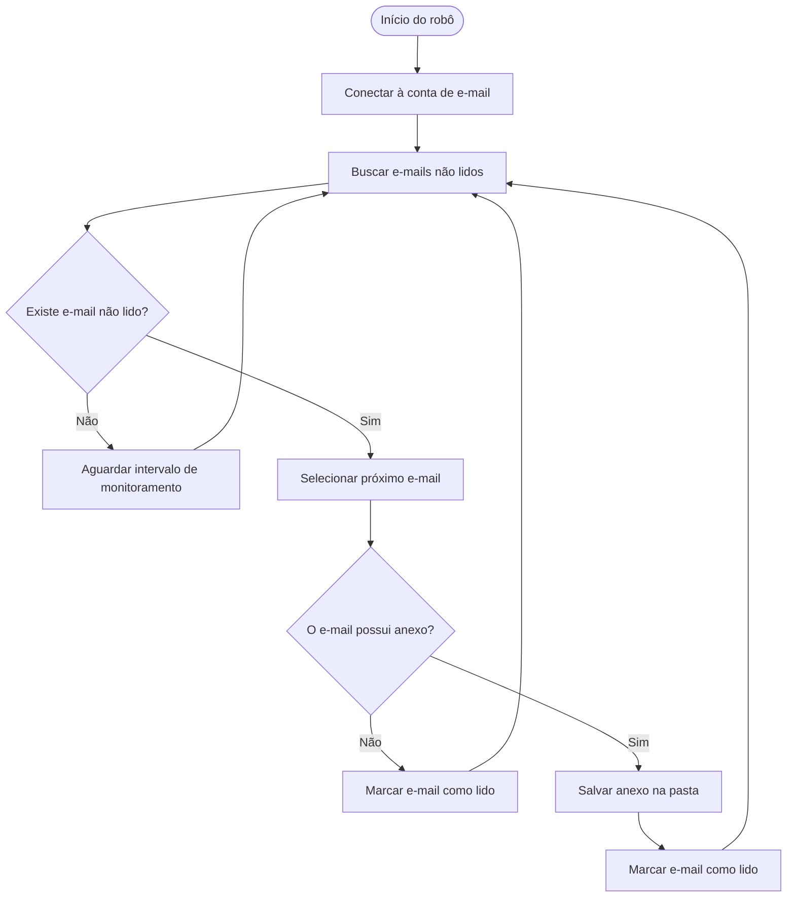
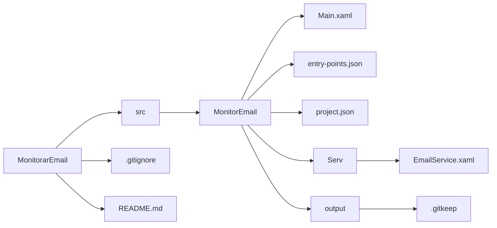

# Robô Monitor de E-mail
Esse projeto visa implementar uma automação que irá monitorar certa pasta em uma conta de e-mail, ler as mensagem e fazer download de qualquer anexo para um diretório local.

## Objetivos do Robô
1. Monitorar uma caixa de E-mail;
2. Identificar se chegam novas mensagens;
3. Verificar se essas mensagens possuem anexos;
4. Se tiver anexos:
 - Marcar o e-mail como lido;
 - Salvar os anexos em uma pasta local.
 
 ## Contribuição do robô
 1. Evita trabalho repetitivo;
 2. Evita erros humanos;
 3. Evita atrasos no processamento de documento.
 
## Diagrama

## Estrutura do Repositório

